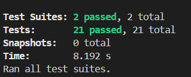
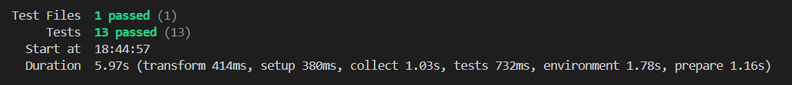
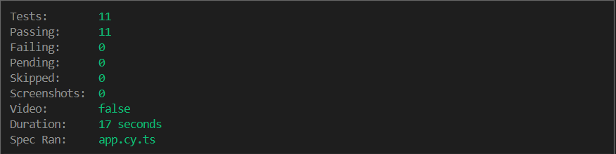

# coverageX_assessment
This repository contains my solution to the CoverageX assessment for the Full Stack Software Engineer position.  
The assignment was to build a simple SPA task manager application.

The system consists of three main components:

1. **Database** → MySQL  
2. **Backend** → Node.js with Express (TypeScript)  
3. **Frontend** → React + Vite + Tailwind (TypeScript)


### Testing Evidence

| Test Type  | Screenshot |
|------------|------------|
| Backend    |  |
| Frontend   |  |
| E2E        |  |


# Todo Application - Docker Setup

## Prerequisites
- Docker 
- Docker Compose 
- Linux development environment with Bash

## Project Structure
```
coverageX_assessment/
├── docker-compose.yml
├── database/
│   └── init.sql
├── backend/
│   ├── Dockerfile
│   ├── .dockerignore
│   ├── package.json
│   ├── tsconfig.json
│   └── src/
├── frontend/
│   ├── Dockerfile
│   ├── .dockerignore
│   ├── nginx.conf
│   ├── package.json
│   ├── tsconfig.json
│   └── src/
└── README.md
```

## Quick Start

### 1. Clone and Navigate
```bash
git clone <https://github.com/kavi20011211/coverageX_assessment.git>
cd coverageX_assessment
```

### 2. Build and Start All Services
```bash
# Build and start all containers
docker-compose up --build

# Or run in detached mode
docker-compose up --build -d
```

### 3. Access the Application
- **Frontend:** http://localhost:5173
- **Backend API:** http://localhost:5000
- **Database:** localhost:3306

## Docker Commands

### Basic Operations
```bash
# Start services
docker-compose up

# Start in background
docker-compose up -d

# Stop services
docker-compose down

# Stop and remove volumes (WARNING: This will delete all data)
docker-compose down -v

# View logs
docker-compose logs
docker-compose logs backend
docker-compose logs frontend
docker-compose logs mysql
```

### Development Commands
```bash
# Rebuild specific service
docker-compose build backend
docker-compose build frontend

# Restart specific service
docker-compose restart backend

# Execute commands in running container
docker-compose exec backend npm run test
docker-compose exec mysql mysql -u todouser -p todoapp
```

## Environment Configuration

### Backend Environment Variables
The backend uses these environment variables (configured in docker-compose.yml):
- `DATABASE_HOST=mysql`
- `DATABASE_PORT=3306`
- `DATABASE_NAME=assignment_todo_app_db`
- `DATABASE_USER=root`
- `DATABASE_PASSWORD=rootpassword`
- `PORT=5000`

## Database Setup

The MySQL database is automatically initialized with:
- Database name: `assignment_todo_app_db`
- User: `root`
- Password: `rootpassword`

### Create the table using this command:
```
docker exec -i mysql mysql -uroot -prootpassword << EOF
USE assignment_todo_app_db;
CREATE TABLE IF NOT EXISTS task (
    task_id INT AUTO_INCREMENT PRIMARY KEY,
    topic VARCHAR(45) NOT NULL,
    description VARCHAR(200),
    created_at TIMESTAMP DEFAULT CURRENT_TIMESTAMP
);
EOF
```

### If not,

```
docker exec -it mysql mysql -uroot -prootpassword assignment_todo_app_db
```
### then run the below sql query

### Database Schema
```sql
USE assignment_todo_app_db;
CREATE TABLE IF NOT EXISTS task (
    task_id INT AUTO_INCREMENT PRIMARY KEY,
    topic VARCHAR(45) NOT NULL,
    description VARCHAR(200),
    created_at TIMESTAMP DEFAULT CURRENT_TIMESTAMP
);
```

## API Endpoints

- `GET /tasks/get-all` - Get tasks
- `POST /tasks/create` - Create new task
- `PUT /tasks/:task_id/update` - Update existing task
- `DELETE /tasks/:task_id/delete` - Delete task
- `GET /api/health` - Health check

## Running Tests

### Backend Tests
```bash
# Run tests in backend container
docker-compose exec backend npm run test
```

### Frontend Tests
```bash
# Run tests in frontend container
docker-compose exec frontend npm run test
```

### Frontend E2E Tests
```bash
# Run E2E tests in frontend container
docker-compose exec cypress sh

npm install

Xvfb :99 -screen 0 1280x1024x24 & export DISPLAY=:99
npm run test:e2e

```

## Troubleshooting

### Port Conflicts
If ports 3000, 5000, or 3306 are already in use, modify the port mappings in `docker-compose.yml`:
```yaml
ports:
  - "5173:80"  # Frontend
  - "5000:5000"  # Backend
  - "3307:3306"  # Database
```

### Database Connection Issues
```bash
# Check if database is ready
docker-compose logs mysql

# Connect to database manually
docker-compose exec mysql mysql -u root -p rootpassword
```

### Container Build Issues
```bash
# Clean rebuild
docker-compose down
docker-compose build --no-cache
docker-compose up

# Remove all containers and images
docker system prune -a
```

### View Container Status
```bash
# Check running containers
docker-compose ps

# Check resource usage
docker stats
```

## Production Considerations

For production deployment, consider:
- Using environment-specific docker-compose files
- Implementing proper secrets management
- Adding SSL/TLS certificates
- Setting up proper logging and monitoring
- Using production-grade database configurations
- Implementing backup strategies

## Development vs Production

This setup is optimized for assessment purposes. For development:
- Enable hot reloading by mounting source code volumes
- Use development database with persistent volumes
- Enable debug modes and detailed logging
